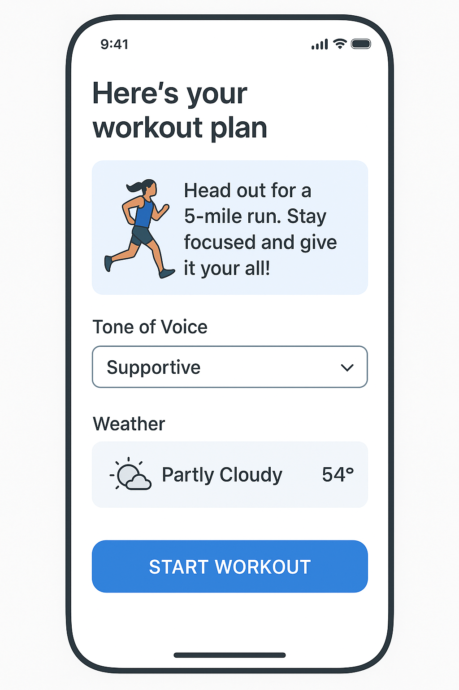
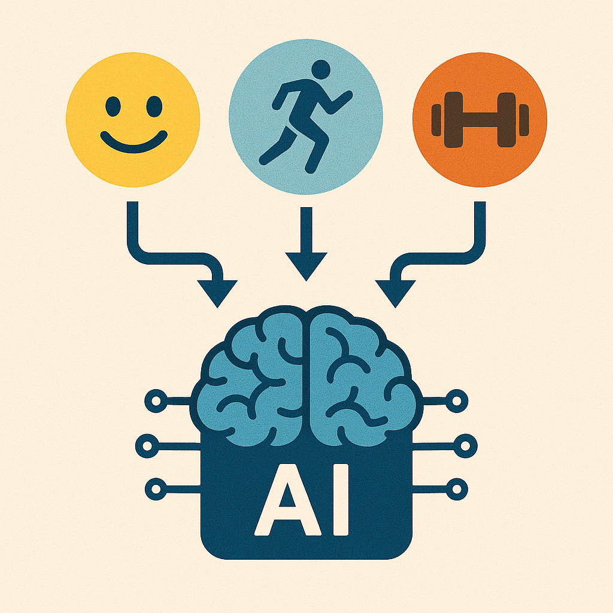
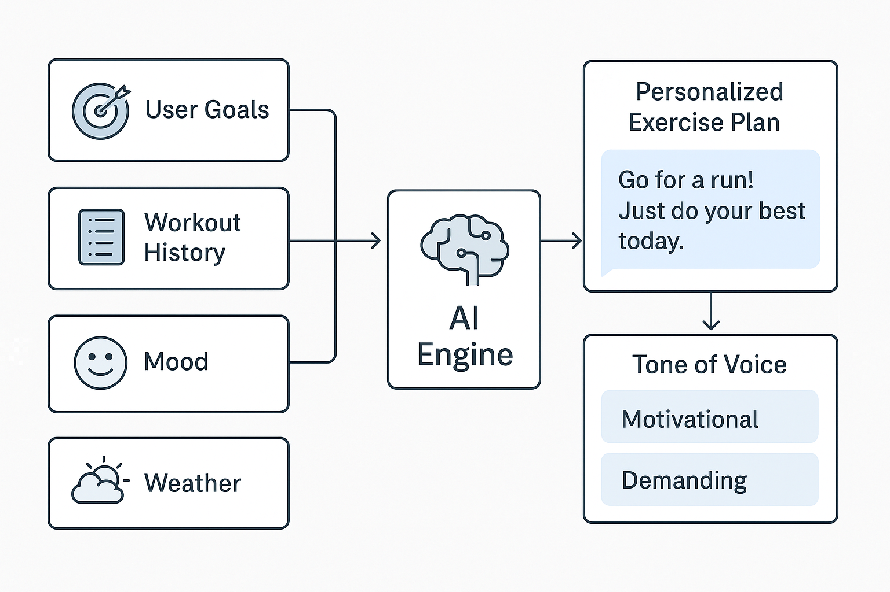
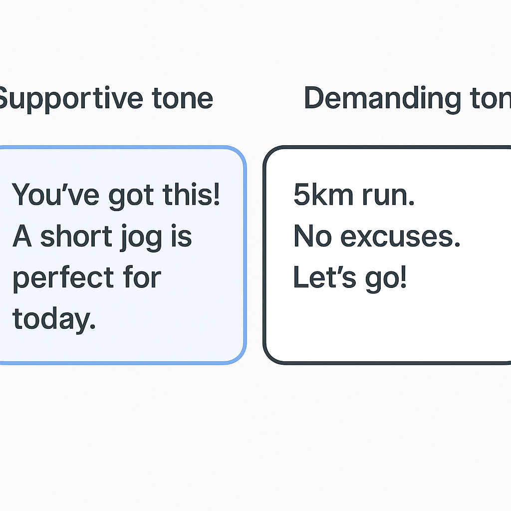
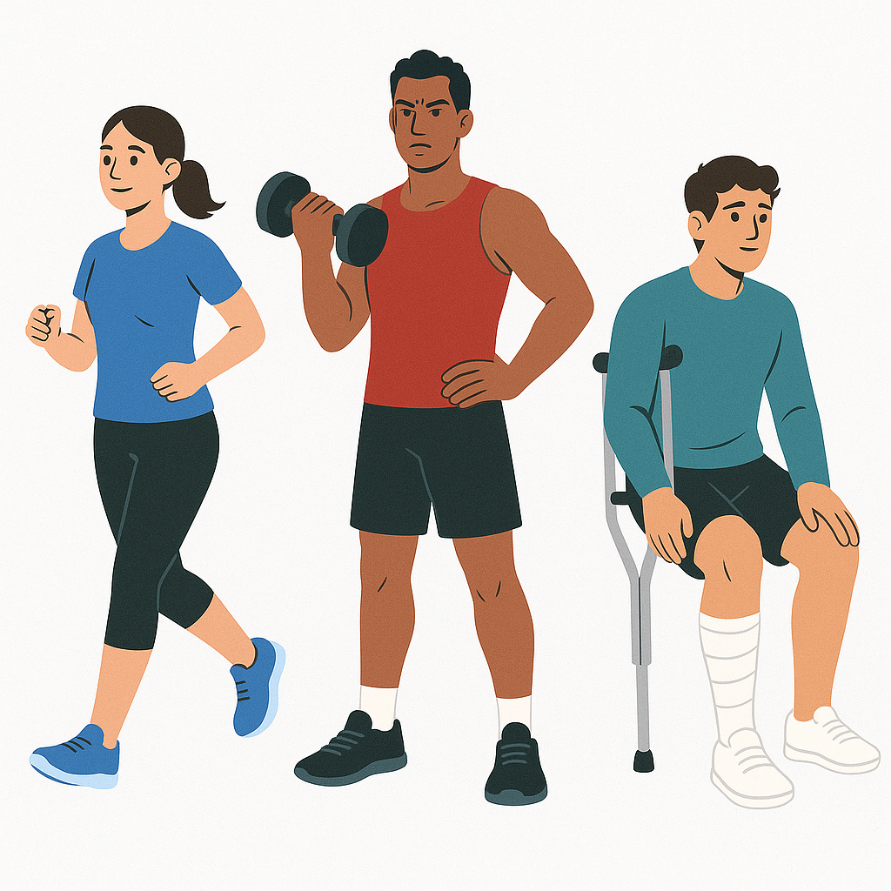

# buildingAI
Building AI project
<!-- This is the markdown template for the final project of the Building AI course, 
created by Reaktor Innovations and University of Helsinki. 
Copy the template, paste it to your GitHub README and edit! -->

# Project Title

Final project for the Building AI course

## Summary

Describe briefly in 2-3 sentences what your project is about. About 250 characters is a nice length! 
This project is about giving personalized training instructions. The instructions are given based on user's targets, previous recorded exercises, user's general feeling/readiness for training, expected weather etc.
The user can choose tone of voice that fits to their expectations (supportive, demanding, etc.)

## Background
Which problems does your idea solve? How common or frequent is this problem? What is your personal motivation? Why is this topic important or interesting?

The idea solves the challenge of knowing what kind of exercise would be suitable for each day without having a personal trainer available. The idea also encourages the user to do even a light exercise when they face more stress or otherwise lack energy. On the other hand, when the user has a strong exercise history, the solution can encourage to increase the training load. 

## How is it used?
Describe the process of using the solution. In what kind situations is the solution needed (environment, time, etc.)? Who are the users, what kinds of needs should be taken into account?

The solution is best used as a mobile app. Also a webapp might be suitable for certain users.
The app provides a weekly/monthly preliminary training plan to to allow scheduling the exercises in Outlook etc. calendar. On daily basis, the app would suggest the user a recommended exercise or to have a recovery day. For recovery days suggestions such as having a walk or doing some strecthing would be given.

 

## Data sources and AI methods
Where does your data come from? Do you collect it yourself or do you use data collected by someone else?

| data            | Description           |
| -----------     | -----------           |
| training data   | from user             |
| targets         | from user             |
| weather         | from internet         |
| feeling         | from user             |
| tone            | from user             |
| available time  | from calendar         |

**| AI method           | Description                                                                |
| genAI                 | interpret user input: targets, feelings                                    |
| genAI                 | generate output: training instructions                                     |
| machine learning      | analyze reported feelings after exercise, try to optimize positive feeling |

## Challenges

What does your project _not_ solve? Which limitations and ethical considerations should be taken into account when deploying a solution like this?
The instructions are given by generative AI. They are not curated or reviewed by professionals. 
The personal health data or limitations to do exercises are not collected unless speficically given by the user. E.g. "I am recovering from a flue, please adjust my training plan".

## What next?

The project would need first service design expertise to validate the assumptions with real potential users. 
After that development and data skills would be needed to plan the architecture and implement it.

## Acknowledgments

* building AI course material
* images created with OpenAI plus subscription
